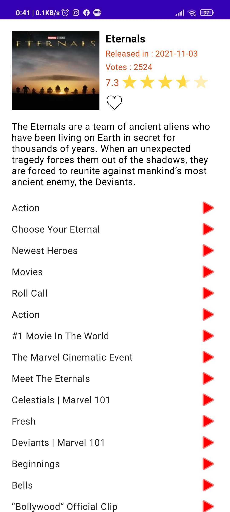

# MVIComposeSample
Android Sample app to show user latest movies implementing  MVI + Clean Architecture using kotlin & Jetpack compose following solid and clean code principles .

**The goal of this app is to show how to implement MVI design pattern with architecture components, clean architecture & Jetpack compose in Kotlin .**

##  Tech stack:

Kotlin, MVI, Jetpack Compose(UI), Hilt, Retrofit, Room, Coroutines, Navigation-component, Package by feature.

##  Source Code representation :

- database : Database for the favourite movies selected by user using Room.
- di : Dependency injection modules supporting Hilt.
- feature : Contains sub packages which represent the feature screens of the app and also MainActivity class handling navigation between fragment using navigation component.
- movies : Main Screen with grid displaying all movies list.
- detail : Detail screen displaying selected movie details & trailer list.
- theme : Theme values generated by compose to use throughout the app ui.
- utils : Base level viewModel and AppConstants class.

**Each package is divided into multiple packages demonstrated as following.**

- composable : Contains the Composable functions responsible for drawing the UI.
- data : Contains data layer which has remote data sources with repository implementation.
- intent : Contains the intent class which hold actions from view to viewmodel.
- state : Contains the uiState class that is responsible for representing the uiState in the composable function.
- view : Contains the view layer (fragment/activities).
- viewmodel : Contains the viewModel.

**Please note that each developer has his own style in coding ,The goal is to implement the concepts of the design and architecting in the right way .**

### Contribution

Please feel free to make a pull request or fork.

### Rate

If you find this repository useful please give it a star .
